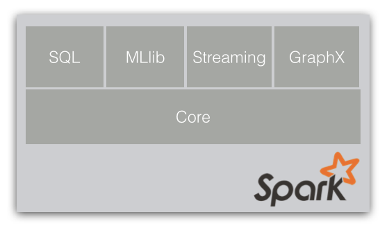

# Welcome
Welcome to the Spark Summit 2014 Training hands-on exercises! Much of this material 
is extended and enhanced from those given at previous <a
href="http://ampcamp.berkeley.edu">AMP Camp Big Data Bootcamps</a>.

 These hands-on exercises 
will have you walk through examples of how to use the higher-level libraries in the Spark project: 
Spark SQL, Spark Streaming, MLlib, & GraphX.

# Prerequisites

## Assumptions
In order to get the most out of this course, we assume:

 * You have experience using the core Spark APIs 
 * You have a laptop
 * Your laptop has Java 6 or 7 installed
 
If you would like a quick primer on Scala, check out the following doc in the appendix:

 * [Introduction to the Scala Shell](introduction-to-the-scala-shell.html)
 
# Exercises Overview

## Languages Used
<table class="bordered" id="langs-table">
<thead>
<tr>
  <th>Section</th>
    <th></th>
    <th></th>
    <th>
  </th>
</tr>
</thead><tbody>
<tr>
<!--  <td>Spark Interactive</td>
  <td class="yes">yes</td>
  <td class="no">no</td>
  <td class="yes">yes</td>
-->
</tr><tr>
  <td>Spark SQL Interactive</td>
  <td class="yes">yes</td>
  <td class="no">no</td>
  <td class="yes">yes</td>
</tr><tr>
  <td>Spark Streaming</td>
  <td class="yes">yes</td>
  <td class="yes">yes</td>
  <td class="no">no</td>
</tr><tr>
  <td>MLlib - Machine Learning</td>
  <td class="yes">yes</td>
  <td class="no">no</td>
  <td class="yes">yes</td>
</tr><tr>
  <td>GraphX - Graph Analytics</td>
  <td class="yes">yes</td>
  <td class="no">no</td>
  <td class="no">no</td>
</tr>
</tbody>
</table>

In several of the proceeding training modules, you can choose which language 
you want to use as you follow along and gain experience with the tools. 
The following table shows which languages this mini course supports for each section. 
You are welcome to mix and match languages depending on your preferences and interests.

## Exercise Content
The modules we will cover at the advanced Spark training are listed below.
These can be done _**in any order**_ according to your interests.

{:.bordered}
| Exercise                                          |   Description                                         | Length |   More Documentation                                                                  |
|---------------------------------------------------|-------------------------------------------------------|:------:|:------------------------------------------------------------------------------:|
| [Spark SQL](data-exploration-using-spark-sql.html) | Use the Spark shell to write interactive SQL queries  | Short |[Programming Guide](http://spark.apache.org/docs/latest/sql-programming-guide.html)   |
| [Spark Streaming](realtime-processing-with-spark-streaming.html) | Process a sample of Twitter tweet streams | Medium |[Programming Guide](http://spark.apache.org/docs/latest/streaming-programming-guide.html)   |
| [MLlib](movie-recommendation-with-mllib.html) | Build a movie recommender with Spark | Medium |[Programming Guide](http://spark.apache.org/docs/latest/mllib-guide.html)   |
| [GraphX](graph-analytics-with-graphx.html) | Explore graph-structured data and graph algorithms  | Long | [Programming Guide](http://spark.apache.org/docs/latest/sql-programming-guide.html)   |

# Providing feedback
Once you complete the course, we would appreciate hearing your feedback. Please fill out the following survey:

 * [Spark Summit 2014 Advanced Workshop Survey](survey.html)

