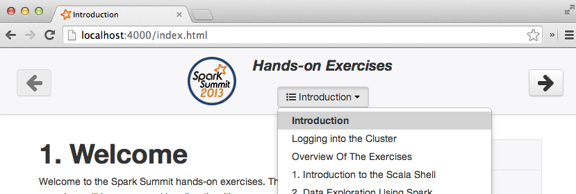

# Welcome
Welcome to the Spark Summit hands-on exercises. These exercises will have you working directly with components of our open-source software stack,
called the <a href="https://amplab.cs.berkeley.edu/software/">Berkeley Data Analytics Stack
(BDAS)</a>.

You can navigate around the exercises by looking in the page header or footer and clicking on the arrows or the dropdown button that shows the current page title (as shown in the figure below).

The components we will cover at the first Spark Training are listed below.

## Introductory Exercises

* [Scala](introduction-to-the-scala-shell.html) - a quick crashcourse on the Scala language and command line interface.
* [Spark](data-exploration-using-spark.html) [(project homepage)](http://spark.incubator.apache.org) - a fast cluster compute engine.
* [Shark](data-exploration-using-shark.html) [(project homepage)](http://shark.cs.berkeley.edu) - a SQL layer on top of Spark.

## Advanced Exercises
* [Spark Streaming](realtime-processing-with-spark-streaming.html) [(project overview page)](http://spark-project.org/docs/latest/streaming-programming-guide.html) - A stream processing layer on top of Spark.
* [Machine Learning with Spark and MLlib](ml-with-spark-and-mllib.html) [(project page)](http://spark.incubator.apache.org/docs/latest/mllib-guide.html) - A library of fast and easy to use ML algorithms included with Spark.

# Course Prerequisites
Several components support multiple languages. In some sections of this training material, you can choose which language you want to use as you follow along and gain experience with the tools. The following table shows which languages this mini course supports for each section. You are welcome to mix and match languages depending on your preferences and interests.

<table class="bordered">
<thead>
<tr>
  <th>Section</th>
    <th></th>
    <th></th>
    <th>
  </th>
</tr>
</thead><tbody>
<tr>
  <td>Spark Interactive</td>
  <td class="yes">yes</td>
  <td class="no">no</td>
  <td class="yes">yes</td>
</tr><tr>
  <td>Shark Interactive</td>
  <td colspan="3" class="yes">All SQL</td>
</tr><tr>
  <td>Spark Streaming</td>
  <td class="yes">yes</td>
  <td class="yes">yes</td>
  <td class="no">no</td>
</tr><tr>
  <td>Machine Learning with Spark and MLlib</td>
  <td class="yes">yes</td>
  <td class="yes">yes</td>
  <td class="no">no</td>
</tr>
</tbody>
</table>

# Providing feedback
We are using the cutting edge versions (i.e., the master branches) of most of our software components, which means you may run into a few issues. If you do, please call over a TA and explain what's going on. To report a problem, please create a new issue at the <a href="https://github.com/amplab/training/issues">training docs Github issue Tracker</a> (there is also a link to this in the footer on all pages of the exercises).

# Getting Started

Ok, If you are attending AMP Camp in-person, we have probably given you a hostname and instructions for downloading the private key you will need in the next section to access your cluster.
If you are participating in the exercises from a remote location, you will want to [launch a BDAS cluster on Amazon EC2](launching-a-bdas-cluster-on-ec2.html) for yourself.
