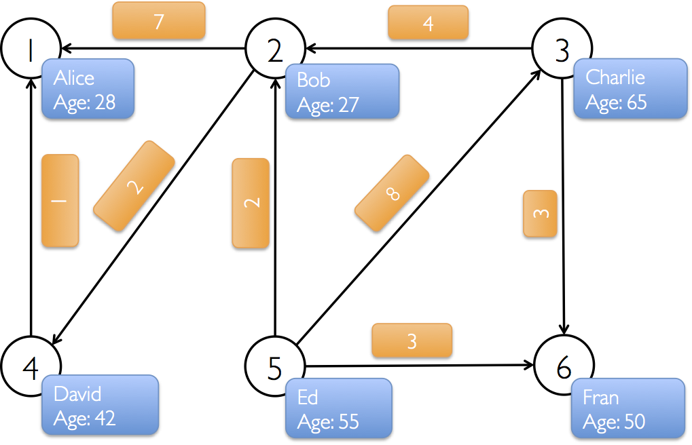

{:toc}

  
<!-- In this chapter we use GraphX to analyze Wikipedia data and implement graph algorithms in Spark. As with other exercises we will work with a subset of the Wikipedia traffic statistics data from May 5-7, 2009. In particular, this dataset only includes a subset of all Wikipedia articles. -->

  
GraphX is the new (alpha) Spark API for graphs (e.g., Web-Graphs and Social Networks) and graph-parallel computation (e.g., PageRank and Collaborative Filtering).
At a high-level, GraphX extends the Spark RDD abstraction by introducing the [Resilient Distributed Property Graph](#property_graph): a directed multigraph with properties attached to each vertex and edge.
To support graph computation, GraphX exposes a set of fundamental operators (e.g., [subgraph][subgraph], [joinVertices][joinVertices], and [mapReduceTriplets][mapReduceTriplets]) as well as an optimized variant of the [Pregel](http://spark.incubator.apache.org/docs/latest/graphx-programming-guide.html#pregel) API.
In addition, GraphX includes a growing collection of graph [algorithms](http://spark.incubator.apache.org/docs/latest/graphx-programming-guide.html#graph_algorithms) and
[builders](http://spark.incubator.apache.org/docs/latest/graphx-programming-guide.html#graph_builders) to simplify graph analytics tasks.

[subgraph]: http://spark.incubator.apache.org/docs/latest/api/graphx/index.html#org.apache.spark.graphx.Graph@subgraph((EdgeTriplet[VD,ED])⇒Boolean,(VertexId,VD)⇒Boolean):Graph[VD,ED]

[joinVertices]: http://spark.incubator.apache.org/docs/latest/api/graphx/index.html#org.apache.spark.graphx.GraphOps@joinVertices[U](RDD[(VertexId,U)])((VertexId,VD,U)⇒VD)(ClassTag[U]):Graph[VD,ED]

[mapReduceTriplets]: http://spark.incubator.apache.org/docs/latest/api/graphx/index.html#org.apache.spark.graphx.Graph@mapReduceTriplets[A](mapFunc:org.apache.spark.graphx.EdgeTriplet[VD,ED]=>Iterator[(org.apache.spark.graphx.VertexId,A)],reduceFunc:(A,A)=>A,activeSetOpt:Option[(org.apache.spark.graphx.VertexRDD[_],org.apache.spark.graphx.EdgeDirection)])(implicitevidence$10:scala.reflect.ClassTag[A]):org.apache.spark.graphx.VertexRDD[A]

[graphAlgorithms]: http://spark.incubator.apache.org/docs/latest/graphx-programming-guide.html#graph_algorithms

In this chapter we use GraphX to analyze Wikipedia data and implement graph algorithms in Spark.
The GraphX API is currently only available in Scala but we plan to provide Java and Python bindings in the future.

## Background on Graph-Parallel Computation (Optional)

If you want to get started coding right away, you can skip this part or come back later.

From social networks to language modeling, the growing scale and importance of graph data has driven the development of numerous new *graph-parallel* systems (e.g., [Giraph](http://giraph.apache.org) and [GraphLab](http://graphlab.org)).
By restricting the types of computation that can be expressed and introducing new techniques to partition and distribute graphs, these systems can efficiently execute sophisticated graph algorithms orders of magnitude faster than more general *data-parallel* systems.

  
  <!-- Images are downsized intentionally to improve quality on retina displays -->

The same restrictions that enable graph-parallel systems to achieve substantial performance gains also limit their ability to express many of the important stages in a typical graph-analytics pipeline.
Moreover while graph-parallel systems are optimized for iterative diffusion algorithms like PageRank they are not well suited to more basic tasks like constructing the graph, modifying its structure, or expressing computation that spans multiple graphs.

These tasks typically require data-movement outside of the graph topology and are often more naturally expressed as operations on tables in more traditional data-parallel systems like Map-Reduce.
Furthermore, how we look at data depends on our objectives and the same raw data may require many different table and graph views throughout the analysis process:

  
  <!-- Images are downsized intentionally to improve quality on retina displays -->

Moreover, it is often desirable to be able to move between table and graph views of the same physical data and to leverage the properties of each view to easily and efficiently express
computation.
However, existing graph analytics pipelines compose graph-parallel and data-parallel systems, leading to extensive data movement and duplication and a complicated programming
model.

  
  <!-- Images are downsized intentionally to improve quality on retina displays -->

The goal of the GraphX project is to unify graph-parallel and data-parallel computation in one system with a single composable API.
The GraphX API enables users to view data both as graphs and as collections (i.e., RDDs) without data movement or duplication. By incorporating recent advances in graph-parallel systems, GraphX is able to optimize the execution of graph operations.

<!-- Prior to the release of GraphX, graph computation in Spark was expressed using Bagel, an implementation of Pregel.
GraphX improves upon Bagel by exposing a richer property graph API, a more streamlined version of the Pregel abstraction, and system optimizations to improve performance and reduce memory overhead.
While we plan to eventually deprecate Bagel, we will continue to support the [Bagel API][BagelAPI] and [Bagel programming guide][BagelGuide].
However, we encourage Bagel users to explore the new GraphX API and comment on issues that may complicate the transition from Bagel.

[BagelAPI]: http://spark.incubator.apache.org/docs/latest/api/bagel/index.html#org.apache.spark.bagel.Bagel$
[BagelGuide]: http://spark.incubator.apache.org/docs/latest/bagel-programming-guide.html -->

## Introduction to the GraphX API

To get started you first need to import GraphX.  Start the Spark-Shell by running the following in the terminal from the USB drive:

<pre class="prettyprint lang-bsh">
usb/$ spark/bin/spark-shell
</pre>

and paste the following in your Spark shell:

~~~
import org.apache.spark.graphx._
import org.apache.spark.rdd.RDD
~~~

### The Property Graph

The [property graph][Graph] is a directed multigraph (a directed graph with potentially multiple parallel edges sharing the same source and destination vertex) with properties attached to each vertex and edge.
<!-- The ability to support parallel edges simplifies modeling scenarios where multiple relationships (e.g., co-worker and friend) can appear between the same vertices. -->
Each vertex is keyed by a *unique* 64-bit long identifier (`VertexID`).
Similarly, edges have corresponding source and destination vertex identifiers.
The properties are stored as Scala/Java objects with each edge and vertex in the graph.

[Graph]: http://spark.incubator.apache.org/docs/latest/api/graphx/index.html#org.apache.spark.graphx.Graph

Throughout the first half of this tutorial we will use the following toy property graph.
While this is hardly <i>big data</i>, it provides an opportunity to learn about the graph data model and the GraphX API.
In this example we have a small social network with users and their ages modeled as vertices and likes modeled as directed edges.
<!-- In this fictional scenario users can like other users multiple times.
 -->

  
  <!-- Images are downsized intentionally to improve quality on retina displays -->

We begin by creating the property graph from arrays of vertices and edges.
Later we will demonstrate how to load real data.
Paste the following code into the spark shell.

~~~
val vertexArray = Array(
  (1L, ("Alice", 28)),
  (2L, ("Bob", 27)),
  (3L, ("Charlie", 65)),
  (4L, ("David", 42)),
  (5L, ("Ed", 55)),
  (6L, ("Fran", 50))
  )
val edgeArray = Array(
  Edge(2L, 1L, 7),
  Edge(2L, 4L, 2),
  Edge(3L, 2L, 4),
  Edge(3L, 6L, 3),
  Edge(4L, 1L, 1),
  Edge(5L, 2L, 2),
  Edge(5L, 3L, 8),
  Edge(5L, 6L, 3)
  )
~~~

Here we use the [`Edge`][Edge] class. Edges have a `srcId` and a `dstId` corresponding to the source and destination vertex identifiers.
In addition, the `Edge` class has an `attr` member which stores the edge property (in this case the number of likes).

<!-- For example the following snippet makes an edge between `VertexId` 1 and 3 with property `works with`:

~~~
val e = Edge(1L, 3L, "works with")
println(e.srcId + " " + e.attr + " " + e.dstId)
~~~

 -->

[Edge]: http://spark.incubator.apache.org/docs/latest/api/graphx/index.html#org.apache.spark.graphx.Edge

Using `sc.parallelize` (introduced in the Spark tutorial) construct the following RDDs from the `vertexArray` and `edgeArray` variables.

> We have made the code blocks editable so that you have space to compose your answer before pasting into the spark shell.

~~~
val vertexRDD: RDD[(Long, (String, Int))] = // Implement
val edgeRDD: RDD[Edge[Int]] = // Implement
~~~

~~~
val vertexRDD: RDD[(Long, (String, Int))] = sc.parallelize(vertexArray)
val edgeRDD: RDD[Edge[Int]] = sc.parallelize(edgeArray)
~~~

Now we are ready to build a property graph.  The basic property graph constructor takes an RDD of vertices (with type `RDD[(VertexId, V)]`) and an RDD of edges (with type `RDD[Edge[E]]`) and builds a graph (with type `Graph[V, E]`).  Try the following:

~~~
val graph: Graph[(String, Int), Int] = Graph(vertexRDD, edgeRDD)
~~~

The vertex property for this graph is a tuple `(String, Int)` corresponding to the *User Name* and *Age* and the edge property is just an `Int` corresponding to the number of *Likes* in our hypothetical social network.

There are numerous ways to construct a property graph from raw files, RDDs, and even synthetic
generators.
Like RDDs, property graphs are immutable, distributed, and fault-tolerant.
Changes to the values or structure of the graph are accomplished by producing a new graph with the desired changes.
Note that substantial parts of the original graph (i.e. unaffected structure, attributes, and indices) are reused in the new graph.
<!-- The graph is partitioned across the workers using vertex-partitioning heuristics. -->
As with RDDs, each partition of the graph can be recreated on a different machine in the event of a failure.

### Graph Views

In many cases we will want to extract the vertex and edge RDD views of a graph (e.g., when aggregating or saving the result of calculation).
As a consequence, the graph class contains members (`graph.vertices` and `graph.edges`) to access the vertices and edges of the graph.
While these members extend `RDD[(VertexId, V)]` and `RDD[Edge[E]]` they are actually backed by optimized representations that leverage the internal GraphX representation of graph data.

Use `graph.vertices` to display the names of the users that are at least `30` years old.  The output should contain (in addition to lots of log messages):

<pre class="prettyprint lang-bsh">
David is 42
Fran is 50
Ed is 55
Charlie is 65
</pre>

Here is a hint:

~~~
graph.vertices.filter {
  case (id, (name, age)) => /* implement */
}.collect.foreach {
  case (id, (name, age)) => /* implement */
}
~~~

~~~
// Solution 1
graph.vertices.filter { case (id, (name, age)) => age > 30 }.collect.foreach {
  case (id, (name, age)) => println(s"$name is $age")
}

// Solution 2
graph.vertices.filter(v => v._2._2 > 30).collect.foreach(v => println(s"${v._2._1} is ${v._2._2}"))

// Solution 3
for ((id,(name,age)) <- graph.vertices.filter { case (id,(name,age)) => age > 30 }.collect) {
  println(s"$name is $age")
}
~~~

Here we use the new String Interpolation feature in Scala 2.10:

~~~
val name = "Joey"
println(s"$name is ${ 3 * 10 }")
~~~

In addition to the vertex and edge views of the property graph, GraphX also exposes a triplet view.
The triplet view logically joins the vertex and edge properties yielding an `RDD[EdgeTriplet[VD, ED]]` containing instances of the [`EdgeTriplet`][EdgeTriplet] class.
This *join* can be expressed graphically as:

  
  <!-- Images are downsized intentionally to improve quality on retina displays -->

<!-- in the following SQL expression:

SELECT src.id, dst.id, src.attr, e.attr, dst.attr
FROM edges AS e LEFT JOIN vertices AS src JOIN vertices AS dst
ON e.srcId = src.Id AND e.dstId = dst.Id

 -->

[EdgeTriplet]: http://spark.incubator.apache.org/docs/latest/api/graphx/index.html#org.apache.spark.graphx.EdgeTriplet

The [`EdgeTriplet`][EdgeTriplet] class extends the [`Edge`][Edge] class by adding the `srcAttr` and `dstAttr` members which contain the source and destination properties respectively.

Use the `graph.triplets` view to display who likes who.  The output should look like:

<pre class="prettyprint lang-bsh">
Bob likes Alice
Bob likes David
Charlie likes Bob
Charlie likes Fran
David likes Alice
Ed likes Bob
Ed likes Charlie
Ed likes Fran
</pre>

Here is a partial solution:

~~~
for (triplet <- graph.triplets.collect) {
 /**
   * Triplet has the following Fields:
   *   triplet.srcAttr: (String, Int) // triplet.srcAttr._1 is the name
   *   triplet.dstAttr: (String, Int)
   *   triplet.attr: Int
   *   triplet.srcId: VertexId
   *   triplet.dstId: VertexId
   */
}
~~~

~~~
for (triplet <- graph.triplets.collect) {
  println(s"${triplet.srcAttr._1} likes ${triplet.dstAttr._1}")
}
~~~

If someone likes someone else more than 5 times than that relationship is getting pretty serious.
For extra credit, find the lovers.

~~~
for (triplet <- graph.triplets.filter(t => t.attr > 5).collect) {
  println(s"${triplet.srcAttr._1} loves ${triplet.dstAttr._1}")
}
~~~

## Graph Operators

Just as RDDs have basic operations like `count`, `map`, `filter`, and `reduceByKey`, property graphs also have a collection of basic operations.
The following is a list of some of the many functions exposed by the Graph API.

~~~
/** Summary of the functionality in the property graph */
class Graph[VD, ED] {
  // Information about the Graph
  val numEdges: Long
  val numVertices: Long
  val inDegrees: VertexRDD[Int]
  val outDegrees: VertexRDD[Int]
  val degrees: VertexRDD[Int]

  // Views of the graph as collections
  val vertices: VertexRDD[VD]
  val edges: EdgeRDD[ED]
  val triplets: RDD[EdgeTriplet[VD, ED]]

  // Change the partitioning heuristic
  def partitionBy(partitionStrategy: PartitionStrategy): Graph[VD, ED]

  // Transform vertex and edge attributes
  def mapVertices[VD2](map: (VertexID, VD) => VD2): Graph[VD2, ED]
  def mapEdges[ED2](map: Edge[ED] => ED2): Graph[VD, ED2]
  def mapEdges[ED2](map: (PartitionID, Iterator[Edge[ED]]) => Iterator[ED2]): Graph[VD, ED2]
  def mapTriplets[ED2](map: EdgeTriplet[VD, ED] => ED2): Graph[VD, ED2]

  // Modify the graph structure
  def reverse: Graph[VD, ED]
  def subgraph(
      epred: EdgeTriplet[VD,ED] => Boolean = (x => true),
      vpred: (VertexID, VD) => Boolean = ((v, d) => true))
    : Graph[VD, ED]
  def groupEdges(merge: (ED, ED) => ED): Graph[VD, ED]

  // Join RDDs with the graph
  def joinVertices[U](table: RDD[(VertexID, U)])(mapFunc: (VertexID, VD, U) => VD): Graph[VD, ED]
  def outerJoinVertices[U, VD2](other: RDD[(VertexID, U)])
      (mapFunc: (VertexID, VD, Option[U]) => VD2)
    : Graph[VD2, ED]

  // Aggregate information about adjacent triplets
  def collectNeighbors(edgeDirection: EdgeDirection): VertexRDD[Array[(VertexID, VD)]]
  def mapReduceTriplets[A: ClassTag](
      mapFunc: EdgeTriplet[VD, ED] => Iterator[(VertexID, A)],
      reduceFunc: (A, A) => A)
    : VertexRDD[A]

  // Iterative graph-parallel computation
  def pregel[A](initialMsg: A, maxIterations: Int, activeDirection: EdgeDirection)(
      vprog: (VertexID, VD, A) => VD,
      sendMsg: EdgeTriplet[VD, ED] => Iterator[(VertexID,A)],
      mergeMsg: (A, A) => A)
    : Graph[VD, ED]

  // Basic graph algorithms
  def pageRank(tol: Double, resetProb: Double = 0.15): Graph[Double, Double]
  def connectedComponents(): Graph[VertexID, ED]
  def triangleCount(): Graph[Int, ED]
  def stronglyConnectedComponents(numIter: Int): Graph[VertexID, ED]
}
~~~

These functions are split between [`Graph`][Graph] and [`GraphOps`][GraphOps].
However, thanks to the "magic" of Scala implicits the operators in `GraphOps` are automatically available as members of `Graph`.

For example, we can compute the in-degree of each vertex (defined in `GraphOps`) by the following:

[GraphOps]: http://spark.incubator.apache.org/docs/latest/api/graphx/index.html#org.apache.spark.graphx.GraphOps

~~~
val inDegrees: VertexRDD[Int] = graph.inDegrees
~~~

In the above example the `graph.inDegrees` operators returned a `VertexRDD[Int]` (recall that this behaves like `RDD[(VertexId, Int)]`).  What if we wanted to incorporate the in and out degree of each vertex into the vertex property?  To do this we will use a set of common graph operators.

First we define a `User` class to better organize the vertex property and build a new graph with the user property (paste the following code into the spark shell):

~~~
// Define a class to more clearly model the user property
case class User(name: String, age: Int, inDeg: Int, outDeg: Int)
// Create a user Graph
val initialUserGraph: Graph[User, Int] = graph.mapVertices{ case (id, (name, age)) => User(name, age, 0, 0) }
~~~

Notice that we initialized each vertex with 0 in and out degree.  Now we join the in and out degree information with each vertex building the new vertex property (paste the following code into the spark shell):

~~~
// Fill in the degree information
val userGraph = initialUserGraph.outerJoinVertices(initialUserGraph.inDegrees) {
  case (id, u, inDegOpt) => User(u.name, u.age, inDegOpt.getOrElse(0), u.outDeg)
}.outerJoinVertices(initialUserGraph.outDegrees) {
  case (id, u, outDegOpt) => User(u.name, u.age, u.inDeg, outDegOpt.getOrElse(0))
}
~~~

Here we use the `outerJoinVertices` method of `Graph` which has the following (confusing) type signature:

~~~
 def outerJoinVertices[U, VD2](other: RDD[(VertexID, U)])
      (mapFunc: (VertexID, VD, Option[U]) => VD2)
    : Graph[VD2, ED]
~~~

Notice that `outerJoinVertices` takes *two* argument lists.
The first contains an `RDD` of vertex values and the second argument list takes a function from the id, attribute, and Optional matching value in the `RDD` to a new vertex value.
Note that it is possible that the input `RDD` may not contain values for some of the vertices in the graph.
In these cases the `Option` argument is empty and `optOutDeg.getOrElse(0)` returns 0.

Using the `degreeGraph` print the number of people who like each user:

<pre class="prettyprint lang-bsh">
User 1 is called Alice and is liked by 2 people.
User 2 is called Bob and is liked by 2 people.
User 3 is called Charlie and is liked by 1 people.
User 4 is called David and is liked by 1 people.
User 5 is called Ed and is liked by 0 people.
User 6 is called Fran and is liked by 2 people.
</pre>

~~~
for ((id, property) <- userGraph.vertices.collect) {
  println(s"User $id is called ${property.name} and is liked by ${property.inDeg} people.")
}
~~~

Print the names of the users who are liked by the same number of people they like.

~~~
userGraph.vertices.filter {
  case (id, u) => u.inDeg == u.outDeg
}.collect.foreach {
  case (id, property) => println(property.name)
}
~~~

### The Map Reduce Triplets Operator

Using the property graph from Section 2.1, suppose we want to find the oldest follower of each user. The [`mapReduceTriplets`][Graph.mapReduceTriplets] operator allows us to do this. It enables neighborhood aggregation, and its simplified signature is as follows:

[Graph.mapReduceTriplets]: http://spark.incubator.apache.org/docs/latest/api/graphx/index.html#org.apache.spark.graphx.Graph@mapReduceTriplets[A](mapFunc:org.apache.spark.graphx.EdgeTriplet[VD,ED]=>Iterator[(org.apache.spark.graphx.VertexId,A)],reduceFunc:(A,A)=>A,activeSetOpt:Option[(org.apache.spark.graphx.VertexRDD[_],org.apache.spark.graphx.EdgeDirection)])(implicitevidence$10:scala.reflect.ClassTag[A]):org.apache.spark.graphx.VertexRDD[A]

~~~
class Graph[VD, ED] {
  def mapReduceTriplets[MsgType](
      // Function from an edge triplet to a collection of messages (i.e., Map)
      map: EdgeTriplet[VD, ED] => Iterator[(VertexId, MsgType)],
      // Function that combines messages to the same vertex (i.e., Reduce)
      reduce: (MsgType, MsgType) => MsgType)
    : VertexRDD[MsgType]
}
~~~

The map function is applied to each edge triplet in the graph, yielding messages destined to the adjacent vertices. The reduce function aggregates messages destined to the same vertex. The operation results in a `VertexRDD` containing the aggregate message for each vertex.

We can find the oldest follower for each user by sending a message containing the name and age of each follower and aggregating the messages by taking the message from the older follower:

~~~
// Find the oldest follower for each user
val oldestFollower: VertexRDD[(String, Int)] = userGraph.mapReduceTriplets[(String, Int)](
  // For each edge send a message to the destination vertex with the attribute of the source vertex
  edge => Iterator((edge.dstId, (edge.srcAttr.name, edge.srcAttr.age))),
  // To combine messages take the message for the older follower
  (a, b) => if (a._2 > b._2) a else b
  )
~~~

Display the oldest follower for each user:

<pre class="prettyprint lang-bsh">
David is the oldest follower of Alice.
Charlie is the oldest follower of Bob.
Ed is the oldest follower of Charlie.
Bob is the oldest follower of David.
Ed does not have any followers.
Charlie is the oldest follower of Fran.
</pre>

~~~
userGraph.vertices.leftJoin(oldestFollower) { (id, user, optOldestFollower) =>
  /**
   * Implement: Generate a string naming the oldest follower of each user
   * Note: Some users may have no messages optOldestFollower.isEmpty if they have no followers
   *
   * Try using the match syntax:
   *
   *  optOldestFollower match {
   *    case None => "No followers! implement me!"
   *    case Some((name, age)) => "implement me!"
   *  }
   *
   */
}.collect.foreach {
  case (id, str) => println(str)
}
~~~

~~~
userGraph.vertices.leftJoin(oldestFollower) { (id, user, optOldestFollower) =>
  optOldestFollower match {
    case None => s"${user.name} does not have any followers."
    case Some((name, age)) => s"${name} is the oldest follower of ${user.name}."
  }
}.collect.foreach { case (id, str) => println(str) }
~~~

As an exercise, try finding the average follower age of the followers of each user.

~~~
val averageAge: VertexRDD[Double] = userGraph.mapReduceTriplets[(Int, Double)](
  // map function returns a tuple of (1, Age)
  edge => Iterator((edge.dstId, (1, edge.srcAttr.age.toDouble))),
  // reduce function combines (sumOfFollowers, sumOfAge)
  (a, b) => ((a._1 + b._1), (a._2 + b._2))
  ).mapValues((id, p) => p._2 / p._1)

// Display the results
userGraph.vertices.leftJoin(averageAge) { (id, user, optAverageAge) =>
  optAverageAge match {
    case None => s"${user.name} does not have any followers."
    case Some(avgAge) => s"The average age of ${user.name}\'s followers is $avgAge."
  }
}.collect.foreach { case (id, str) => println(str) }
~~~

### Subgraph

Suppose we want to study the community structure of users that are 30 or older.
To support this type of analysis GraphX includes the [subgraph][Graph.subgraph] operator that takes vertex and edge predicates and returns the graph containing only the vertices that satisfy the vertex predicate (evaluate to true) and edges that satisfy the edge predicate *and connect vertices that satisfy the vertex predicate*.

In the following we restrict our graph to the users that are 30 or older.

[Graph.subgraph]: http://spark.incubator.apache.org/docs/latest/api/graphx/index.html#org.apache.spark.graphx.Graph@subgraph((EdgeTriplet[VD,ED])⇒Boolean,(VertexId,VD)⇒Boolean):Graph[VD,ED]

~~~
val olderGraph = userGraph.subgraph(vpred = (id, user) => user.age >= 30)
~~~

Lets examine the communities in this restricted graph:

~~~
// compute the connected components
val cc = olderGraph.connectedComponents

// display the component id of each user:
olderGraph.vertices.leftJoin(cc.vertices) {
  case (id, user, comp) => s"${user.name} is in component ${comp.get}"
}.collect.foreach{ case (id, str) => println(str) }
~~~

Connected components are labeled (numbered) by the lowest vertex Id in that component.  Notice that by examining the subgraph we have disconnected David from the rest of his community.  Moreover his connections to the rest of the graph are through younger users.

<!--
As an exercise, use this subgraph to find lonely users who have no strong relationships (i.e., have degree 0 in the subgraph).

~~~
val lonely = strongRelationships.degrees.filter {
  case (id, degree) => degree == 0
}

lonely.collect.foreach(println(_))
~~~

 -->

<!-- ### TODO: Reverse?
### TODO: MapEdges or MapVertices
 -->

## Constructing an End-to-End Graph Analytics Pipeline on Real Data

Now that we have learned about the individual components of the GraphX API, we are ready to put them together to build a real analytics pipeline.
In this section, we will start with Wikipedia link data, use GraphX operators to analyze the structure, and then use Spark operators
to examine the output of the graph analysis, all from the Spark shell.

GraphX requires the Kryo serializer to achieve maximum performance.
To see what serializer is being used check the Spark Shell UI by going to `http://localhost:4040/environment/` and checking if the `spark.serializer` property is set:

  
  <!-- Images are downsized intentionally to improve quality on retina displays -->

By default Kryo Serialization is not enabled.
In this exercise we will walk through the process of enabling Kryo Serialization for the spark shell.
First exit the current Spark Shell (either type exit or ctrl-c).

Open a text editor (e.g., the one true editor emacs or vim) and add the following to `spark/conf/spark-env.sh`:

<pre class="prettyprint lang-bsh">
SPARK_JAVA_OPTS+='
 -Dspark.serializer=org.apache.spark.serializer.KryoSerializer
 -Dspark.kryo.registrator=org.apache.spark.graphx.GraphKryoRegistrator '
export SPARK_JAVA_OPTS
</pre>

or if you are feeling lazy paste the following command in the terminal (not the spark shell):

<pre class="prettyprint lang-bsh">
usb/$ echo -e "SPARK_JAVA_OPTS+=' -Dspark.serializer=org.apache.spark.serializer.KryoSerializer -Dspark.kryo.registrator=org.apache.spark.graphx.GraphKryoRegistrator ' \nexport SPARK_JAVA_OPTS" >> spark/conf/spark-env.sh
</pre>

After starting the Spark shell below, if you check `http://localhost:4040/environment/` the serializer property `spark.serializer` property should be set to `org.apache.spark.serializer.KryoSerializer`.

### Getting Started (Again)

Start the spark shell:

~~~
usb/$ spark/bin/spark-shell
~~~

Import the standard packages.

~~~
import org.apache.spark.graphx._
import org.apache.spark.rdd.RDD
~~~

### Load the Wikipedia Articles

Wikipedia provides [XML dumps](http://en.wikipedia.org/wiki/Wikipedia:Database_download#English-language_Wikipedia) of all articles in the encyclopedia. The latest dump is 44 GB, so we have preprocessed and filtered it (using Spark and GraphX, of course!) to fit on your USB drive. We extracted all articles with "Berkeley" in the title, as well as all articles linked from and linking to those articles. The resulting dataset is stored in two files: `"data/graphx/graphx-wiki-vertices.txt"` and `"data/graphx/graphx-wiki-edges.txt"`. The `graphx-wiki-vertices.txt` file contains articles by ID and title, and the `graphx-wiki-edges.txt` file contains the link structure in the form of source-destination ID pairs.

Load these two files into RDDs:

~~~
val articles: RDD[String] = sc.textFile("data/graphx/graphx-wiki-vertices.txt")
val links: RDD[String] = sc.textFile("data/graphx/graphx-wiki-edges.txt")
~~~

### Look at the First Article

Display the title of the first article:

~~~
articles.first
// res0: String = 6598434222544540151	Adelaide Hanscom Leeson
~~~

### Construct the Graph

Now let's use the articles and links to construct a graph of Berkeley-related articles. First, we parse the article rows into pairs of vertex ID and title:

~~~
val vertices = articles.map { line =>
  val fields = line.split('\t')
  (fields(0).toLong, fields(1))
}
~~~

Next, we parse the link rows into `Edge` objects with the placeholder `0` attribute:

~~~
val edges = links.map { line =>
  val fields = line.split('\t')
  Edge(fields(0).toLong, fields(1).toLong, 0)
}
~~~

Finally, we can create the graph by calling the Graph constructor with our vertex RDD, our edge RDD, and a default vertex attribute.
The default vertex attribute is used to initialize vertices that are not present in the vertex RDD, but are mentioned by an edge (that is, pointed to by a link).
We have pre-cleaned this dataset to remove such inconsistencies, but many real datasets are "dirty."
We will use an empty title string as the default vertex attribute to represent the target of a broken link.

We also cache the resulting graph in memory to avoid reloading it from disk each time we use it.

~~~
val graph = Graph(vertices, edges, "").cache()
~~~

Let's force the graph to be computed by counting how many articles it has:

~~~
graph.vertices.count
~~~

The first time the graph is created, GraphX constructs index data structures for all the vertices in the graph and detects and allocates missing vertices.
Computing the triplets will require an additional join but this should run quickly now that the indexes have been created.

~~~
graph.triplets.count
~~~

Let's look at the first few triplets:

~~~
graph.triplets.take(5).foreach(println(_))
// ((146271392968588,Computer Consoles Inc.),(7097126743572404313,Berkeley Software Distribution),0)
// ((146271392968588,Computer Consoles Inc.),(8830299306937918434,University of California, Berkeley),0)
// ((1889887370673623,Anthony Pawson),(8830299306937918434,University of California, Berkeley),0)
// ((1889887578123422,Anthony Wilden),(6990487747244935452,Busby Berkeley),0)
// ((3044656966074398,Pacific Boychoir),(8262690695090170653,Uc berkeley),0)
~~~

As mentioned earlier, every triplet in this dataset mentions Berkeley either in the source or the destination article title.

### Running PageRank on Wikipedia

We can now do some actual graph analytics.
For this example, we are going to run [PageRank](http://en.wikipedia.org/wiki/PageRank) to evaluate what the most important pages in the Wikipedia graph are.
[`PageRank`][PageRank] is part of a small but growing library of common graph algorithms already implemented in GraphX.
However, the implementation is simple and straightforward, and just consists of some initialization code, a vertex program and message combiner to pass to Pregel.

[PageRank]: http://spark.apache.org/docs/latest/api/scala/index.html#org.apache.spark.graphx.lib.PageRank$

~~~
val prGraph = graph.pageRank(0.001).cache()
~~~

`Graph.pageRank` returns a graph whose vertex attributes are the PageRank values of each page. The `0.001` parameter is the error tolerance that tells PageRank when the ranks have converged.

However, this means that while the resulting graph `prGraph` only contains the PageRank of the vertices and no longer contains the original vertex properties including the title.
Luckily, we still have our `graph` that contains that information.
Here, we can perform a join of the vertices in the `prGraph` that have the information about relative ranks of the vertices with the vertices in the `graph` that have the information about the mapping from vertex to article title.
This yields a new graph that has combined both pieces of information, storing them both in a tuple
as the new vertex attribute. We can then perform further table-based operators on this new list of vertices,
such as finding the ten most important vertices (those with the highest pageranks) and printing out
their corresponding article titles. Putting this all together, and we get the following set of operations
to find the titles of the ten most important articles in the Berkeley subgraph of Wikipedia.

~~~
val titleAndPrGraph = graph.outerJoinVertices(prGraph.vertices) {
  (v, title, rank) => (rank.getOrElse(0.0), title)
}

titleAndPrGraph.vertices.top(10) {
  Ordering.by((entry: (VertexId, (Double, String))) => entry._2._1)
}.foreach(t => println(t._2._2 + ": " + t._2._1))
~~~

This brings us to the end of the GraphX chapter of the tutorial. We encourage you to continue playing with the code and to check out the [GraphX Programming Guide][GraphX Programming Guide] for further documentation about the system.

[GraphX Programming Guide]: http://spark.incubator.apache.org/docs/latest/graphx-programming-guide.html

Bug reports and feature requests are welcomed.
