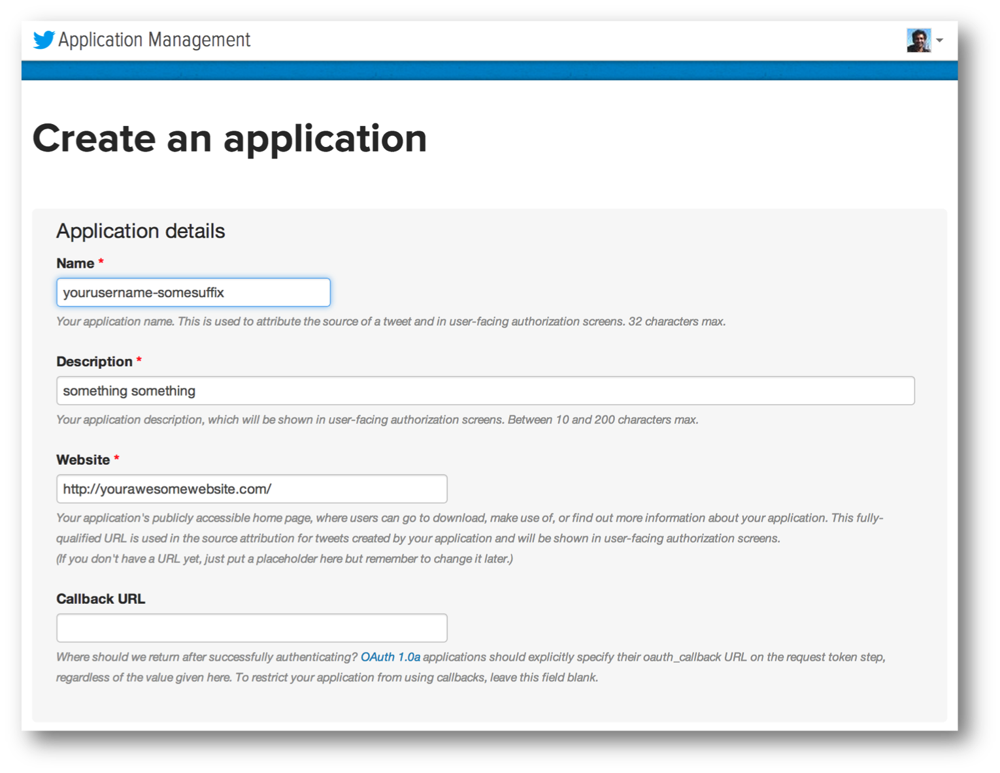
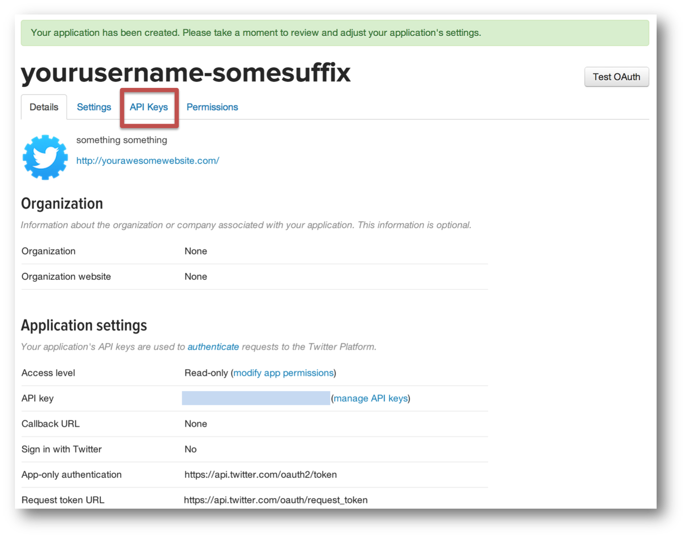

 
In this chapter, we will walk you through using Spark Streaming to process live
data streams. Remember, Spark Streaming is a component of Spark that provides
highly scalable, fault-tolerant streaming processing.

These exercises are designed as standalone Scala programs which will receive and process Twitter's
real sample tweet streams. For the exercises in this section, you can choose to
use Scala or Java. 

## Setup
This section will first introduce you to the basic system setup of the standalone Spark Streaming programs, 
and then guide you through the steps necessary to create Twitter authentication tokens necessary for processing 
Twitter's real time sample stream.

### System Setup

You should find the following items in the directory `[usb root
directory]/streaming/`.

<b>What is SBT?</b>

Simple Build Tool, or SBT, is popular open-source a build tool for Scala and Java projects. Read more about SBT at <a href="https://github.com/harrah/xsbt/wiki" target="_blank">its Github page</a>.

- For Scala users
  - `scala/build.sbt:` SBT project file
  - `scala/Tutorial.scala:` Main Scala program that you are going to edit, compile and run
  - `scala/TutorialHelper.scala:` Scala file containing few helper functions for `Tutorial.scala`
- For Java users
  - `java/build.sbt:` SBT project file
  - `java/Tutorial.java` Main Java program that you are going to edit, compile and run
  - `java/TutorialHeler.java:` Java file containing a few helper functions
  - `java/ScalaHelper.java:` Scala file containing a few helper functions

For your convenience, we have added a couple of helper function to get the parameters that the exercises need.

- `getCheckpointDirectory()` is a helper function that figures out the checkpoint directory that Spark Streaming should use.
- `configureTwitterCredential()` is another helper function that configures Twitter's authentication detail using the file `/root/streaming/twitter.txt`. This is explained further in the next section.

### Twitter Credential Setup

Since all of the exercises are based on Twitter's sample tweet stream, it is necessary to configure authentication with a Twitter account. To do this, you will need to setup a consumer key+secret pair and an access token+secret pair using a Twitter account. Please follow the instructions below to setup these temporary access keys with your Twitter account. These instructions will not require you to provide your Twitter username/password. You will only be required to provide the consumer key and access token pairs that you will generate, which you can easily destroy once you have finished the tutorial. So, your Twitter account will not be compromised in any way.

1. Open <a href="https://dev.twitter.com/apps" target="_blank">Twitter's Application
   Settings page</a>.
   This page lists the set of Twitter-based applications that you own and have
   already created consumer keys and access tokens for.  This list will be
   empty if you have never created any applications.
   
   For this tutorial, create
   a new temporary application. To do this, click on the blue "Create a new
   application" button. The new application page should look the page shown
   below. Provide the required fields. The __Name__ of the application must be
   globally unique, so using your Twitter username as a prefix to the name
   should ensure that. For example, set it as [your-twitter-handle]-test. For
   the __Description__ , anything longer than 10 characters is fine. 
   For the __Website__ , similarly, any
   website is fine, but ensure that it is a fully-formed URL with the prefix
   <em>http://</em> . Then, click on the "Yes, I agree" checkbox below the __Developer
   Rules of the Road__ . Finally, fill in the CAPTCHA and click on the blue
   "Create your Twitter application" button.

    

2. Once you have created the application, you will be presented with
   a confirmation page similar to the one shown below. Click on the 
   __API Key__ tab.
     
 
3. You should be able to
   see the API key and the API secret that have been generated. To
   generate the access token and the access token secret, click on the 
   "Create my access token" button at the bottom of the page (marked in red
   in the figure below). Note that there will be a small green confirmation at
   the top of the page saying that the token has been generated.

    

4. Finally, the page should look like the following. Notice the API Key, API Secret, Access Token and Access Token Secret.
   We are going to use these 4 keys in the next section. After you have finished this tutorial, you can delete all these 
   keys by following the instructions at the end of the tutorial.

    

## First Spark Streaming program
Let's try to write a very simple Spark Streaming program that prints a sample of the tweets it receives from Twitter every second. First locate the file
`Tutorial.scala` (in `[usb root directory]/streaming/scala/`) or `Tutorial.java` and edit it with a text editor.

The file contains the following template code to help you out.

~~~
object Tutorial {
  def main(args: Array[String]) {

    // Checkpoint directory
    val checkpointDir = TutorialHelper.getCheckpointDirectory()

    // Configure Twitter credentials
    val apiKey = ""
    val apiSecret = ""
    val accessToken = ""
    val accessTokenSecret = ""
    TutorialHelper.configureTwitterCredentials(apiKey, apiSecret, accessToken, accessTokenSecret)

    // Your code goes here

  }
}
~~~

~~~
public class Tutorial {
  public static void main(String[] args) throws Exception {

    // Checkpoint directory
    String checkpointDir = TutorialHelper.getCheckpointDirectory();

    // Configuring Twitter credentials
    String apiKey = ""
    String apiSecret = ""
    String accessToken = ""
    String accessTokenSecret = ""
    TutorialHelper.configureTwitterCredentials(apiKey, apiSecret, accessToken, accessTokenSecret);

    // Your code goes here

  }
}
~~~

First let's add the authentication keys that you generated in the previous step. After entering the keys
in the corresponding strings, your file should look something like this. 

~~~
val apiKey = "NJba5XGDPXWNkR5TkIC5yN7p8"
val apiSecret = "te7SMATtK3Z143Ywh25LpABkdmq6Cdv1ShYz2bOUgALP5xNBBm"
val accessToken = "479920148-Szmnf2MXKfAz3K3voIuRHyau82aOdfeinGtfyDZZ"
val accessTokenSecret = "2BtiPuEgSDMFOMtUJ9DtuLS5Q2Q9FJoJ0DdI6KJhZK099"
~~~

~~~
String apiKey = "NJba5XGDPXWNkR5TkIC5yN7p8";
String apiSecret = "te7SMATtK3Z143Ywh25LpABkdmq6Cdv1ShYz2bOUgALP5xNBBm";
String accessToken = "479920148-Szmnf2MXKfAz3K3voIuRHyau82aOdfeinGtfyDZZ";
String accessTokenSecret = "2BtiPuEgSDMFOMtUJ9DtuLS5Q2Q9FJoJ0DdI6KJhZK099";
~~~

To express any Spark Streaming computation, a `StreamingContext` object needs to be created.
This object serves as the main entry point for all Spark Streaming functionality. For the rest of this exercise, insert the code samples after "//Your Code goes here" placeholder. 

~~~
val ssc = new StreamingContext(new SparkConf(), Seconds(1))
~~~

~~~
JavaStreamingContext ssc = new JavaStreamingContext(new SparkConf(), new Duration(1000));
~~~

Here, we created a StreamingContext object by providing a Spark configuration, and the batch duration we'd like to use for streams. Next, we use this context to create a stream of tweets:

~~~
val tweets = TwitterUtils.createStream(ssc, None)
~~~

~~~
JavaDStream<Status> tweets = TwitterUtils.createStream(ssc);
~~~

The object `tweets` is a DStream of tweet statuses. More specifically, it is continuous stream of RDDs containing objects of type [twitter4j.Status](http://twitter4j.org/javadoc/twitter4j/Status.html). As a very simple processing step, let's try to print the status text of the some of the tweets.

~~~
val statuses = tweets.map(status => status.getText())
statuses.print()
~~~

~~~
JavaDStream<String> statuses = tweets.map(
  new Function<Status, String>() {
    public String call(Status status) { return status.getText(); }
  }
);
statuses.print();
~~~

Similar to RDD transformation in the earlier Spark exercises, the `map`
operation on `tweets` maps each Status object to its text to create a new
'transformed' DStream named `statuses`. The `print` output operation tells the
context to print first 10 records in each RDD in a DStream, which in this case
are 1 second batches of received status texts.

We also need to set the directory for periodic checkpointing of the intermediate data.

~~~
ssc.checkpoint(checkpointDir)
~~~

~~~
ssc.checkpoint(checkpointDir);
~~~

Finally, we need to tell the context to start running the computation we have setup.

~~~
ssc.start()
ssc.awaitTermination()
~~~

~~~
ssc.start();
ssc.awaitTermination();
~~~

__Note that all DStream operations must be done before calling this statement.__

After saving `Tutorial.scala`, let us compile the code. To do this, follow these instructions.
__Make sure you replace `[usb root directory]` in the following instructions with your actual USB root directory path.__

In the console, make sure you are in the directory: [usb root directory]/streaming/scala .
`../../sbt/sbt assembly`
This command will compile the `Tutorial` class and create a JAR file in `[usb root directory]/streaming/scala/target/scala-2.10/`. 

In the console, make sure you are in the directory: [usb root directory]/streaming/java .
`../../sbt/sbt assembly`
This command will compile the `Tutorial` class and create a JAR file in `[usb root directory]/streaming/java/target/scala-2.10/`. 

Finally, the program can be executed as using the `spark-submit` script. At the command line, run the following. Again, __make sure you replace `[usb root directory]` with your actual USB root directory path.__

<pre class="prettyprint lang-bsh">
../../spark/bin/spark-submit --class Tutorial ../../streaming/scala/target/scala-2.10/Tutorial-assembly-0.1-SNAPSHOT.jar
</pre>

<pre class="prettyprint lang-bsh">
../../spark/bin/spark-submit --class Tutorial ../../streaming/java/target/scala-2.10/Tutorial-assembly-0.1-SNAPSHOT.jar
</pre>

You will soon find a sample of the received tweets beeing printed on the screen (can take 10 seconds or so before it start appearing). If you don't find this, 
take a look at the FAQ in the next section. Use `Ctrl + c`, to stop the application.

<pre class="nocode">
-------------------------------------------
Time: 1359886325000 ms
-------------------------------------------
RT @__PiscesBabyyy: You Dont Wanna Hurt Me But Your Constantly Doing It
@Shu_Inukai ?????????????????????????????????????????
@Condormoda Us vaig descobrir a la @080_bcn_fashion. Molt bona desfilada. Salutacions des de #Manresa
RT @dragon_itou: ?RT???????3000???????????????????????????????????10???????

?????????????????2?3???9???? #???? http://t.co/PwyA5dsI ? h ...
Sini aku antar ke RSJ ya "@NiieSiiRenii: Memang (?? ?`? )"@RiskiMaris: Stresss"@NiieSiiRenii: Sukasuka aku donk:p"@RiskiMaris: Makanya jgn"
@brennn_star lol I would love to come back, you seem pretty cool! I just dont know if I could ever do graveyard again :( It KILLs me
????????????????????????????????????????????????????????????????????????????????????????ww
??????????
When the first boats left the rock with the artificers employed on.
@tgs_nth ????????????????????????????
...

-------------------------------------------
Time: 1359886326000 ms
-------------------------------------------
???????????
???????????
@amatuki007 ????????????????????????????????
?????????????????
RT @BrunoMars: Wooh!
Lo malo es qe no tiene toallitas
Sayang beb RT @enjaaangg Piye ya perasaanmu nyg aku :o
Baz? ?eyler yar??ma ya da reklam konusu olmamal? d???ncesini yenemiyorum.
?????????????MTV???????the HIATUS??
@anisyifaa haha. Cukupla merepek sikit2 :3
@RemyBot ?????????
...
</pre>

### Frequently Asked Questions

__FAQ 1__ : If you see an exception that looks like the following, it means that one of the token / keys has not been set in the Twitter configuration. 

<pre class="nocode">
Configuring Twitter OAuth
Exception in thread "main" java.lang.Exception: Error setting authentication - value for apiKey not set
  at TutorialHelper$$anonfun$configureTwitterCredentials$1.apply(TutorialHelper.scala:21)
  at TutorialHelper$$anonfun$configureTwitterCredentials$1.apply(TutorialHelper.scala:19)

</pre>

Please verify that you have set all the configurations keys correctly as instructed earlier.

__FAQ 2__: If you see the following message, it means that the authentication with Twitter failed.

<pre class="nocode">
  Authentication credentials (https://dev.twitter.com/pages/auth) were missing or incorrect. Ensure that you have set valid consumer key/secret, access token/secret, and the system clock is in sync.
&lt;html&gt;\n&lt;head&gt;\n&lt;meta http-equiv="Content-Type" content="text/html; charset=utf-8"/&gt;\n&lt;title&gt;Error 401 Unauthorized&lt;/title&gt;
&lt;/head&gt;
&lt;body&gt;
&lt;h2&gt;HTTP ERROR: 401&lt;/h2&gt;
&lt;p&gt;Problem accessing '/1.1/statuses/sample.json?stall_warnings=true'. Reason:
&lt;pre&gt;    Unauthorized&lt;/pre&gt;
&lt;/body&gt;
&lt;/html&gt;

Relevant discussions can be found on the Internet at:
  http://www.google.co.jp/search?q=d0031b0b or
  http://www.google.co.jp/search?q=1db75513
TwitterException{exceptionCode=[d0031b0b-1db75513], statusCode=401, message=null, code=-1, retryAfter=-1, rateLimitStatus=null, version=3.0.3}
  at twitter4j.internal.http.HttpClientImpl.request(HttpClientImpl.java:177)
  at twitter4j.internal.http.HttpClientWrapper.request(HttpClientWrapper.java:61)
  at twitter4j.internal.http.HttpClientWrapper.get(HttpClientWrapper.java:89)
  at twitter4j.TwitterStreamImpl.getSampleStream(TwitterStreamImpl.java:176)
  at twitter4j.TwitterStreamImpl$4.getStream(TwitterStreamImpl.java:164)
  at twitter4j.TwitterStreamImpl$TwitterStreamConsumer.run(TwitterStreamImpl.java:462)

</pre>

Please verify that you have set all the configurations keys correctly (double check with the Twitter website) as instructed earlier.

## Further Exercises
Next, let's try something more interesting, say, try printing the 10 most popular hashtags in the last 5 minutes. These next steps explain the set of the DStream operations required to achieve our goal. As mentioned before, the operations explained in the next steps must be added in the program before `ssc.start()`. After every step, you can see the contents of new DStream you created by using the `print()` operation and running Tutorial in the same way as explained earlier (that is, `sbt/sbt package run`).

1. __Get the stream of hashtags from the stream of tweets__:
   To get the hashtags from the status string, we need to identify only those words in the message that start with "#". This can be done as follows:

   

   

   ~~~
   val words = statuses.flatMap(status => status.split(" "))
   val hashtags = words.filter(word => word.startsWith("#"))
   ~~~

   

   

   ~~~
   JavaDStream<String> words = statuses.flatMap(
     new FlatMapFunction<String, String>() {
       public Iterable<String> call(String in) {
         return Arrays.asList(in.split(" "));
       }
     }
   );

   JavaDStream<String> hashTags = words.filter(
     new Function<String, Boolean>() {
       public Boolean call(String word) { return word.startsWith("#"); }
     }
   );
   ~~~

   

   

   The `flatMap` operation applies a one-to-many operation to each record in a DStream and then flattens the records to create a new DStream.
   In this case, each status string is split by space to produce a DStream where each record is a word.
   Then we apply the `filter` function to retain only the hashtags. The resulting `hashtags` DStream is a stream of RDDs having only the hashtags.
   If you want to see the result, add `hashtags.print()` and try running the program.
   You should see something like this (assuming no other DStream has `print` on it):

   <pre class="nocode">
   -------------------------------------------
   Time: 1359886521000 ms
   -------------------------------------------
   #njnbg
   #njpw
   #?????
   #algeria
   #Annaba
   </pre>

2. __Count the hashtags over a 5 minute window__: Next, we'd like to count these hashtags over a 5 minute moving window.
   A simple way to do this would be to gather together the last 5 minutes of data and process it in the usual map-reduce way --- map each tag to a (tag, 1) key-value pair and
   then reduce by adding the counts. However, in this case, counting over a sliding window can be done more intelligently. As the window moves, the counts of the new data can
   be added to the previous window's counts, and the counts of the old data that falls out of the window can be 'subtracted' from the previous window's counts. This can be
   done using DStreams as follows:

   

   

   ~~~
   val counts = hashtags.map(tag => (tag, 1))
                        .reduceByKeyAndWindow(_ + _, _ - _, Seconds(60 * 5), Seconds(1))
   ~~~

   The `_ + _` and `_ - _` are Scala shorthands for specifying functions to add and subtract two numbers. `Seconds(60 * 5)` specifies
   the window size and `Seconds(1)` specifies the movement of the window.

   

   

   ~~~
   JavaPairDStream<String, Integer> tuples = hashTags.mapToPair(
     new PairFunction<String, String, Integer>() {
       public Tuple2<String, Integer> call(String in) {
         return new Tuple2<String, Integer>(in, 1);
       }
     }
   );

   JavaPairDStream<String, Integer> counts = tuples.reduceByKeyAndWindow(
     new Function2<Integer, Integer, Integer>() {
       public Integer call(Integer i1, Integer i2) { return i1 + i2; }
     },
     new Function2<Integer, Integer, Integer>() {
       public Integer call(Integer i1, Integer i2) { return i1 - i2; }
     },
     new Duration(60 * 5 * 1000),
     new Duration(1 * 1000)
   );
   ~~~

   There are two functions that are being defined for adding and subtracting the counts. `new Duration(60 * 5 * 1000)`
   specifies the window size and `new Duration(1 * 1000)` specifies the movement of the window.

   

   

   Note that only 'invertible' reduce operations that have 'inverse' functions (like how subtraction is the inverse of addition)
   can be optimized in this manner. The generated `counts` DStream will have records that are (hashtag, count) tuples.
   If you `print` counts and run this program, you should see something like this:

   <pre class="nocode">
   -------------------------------------------
   Time: 1359886694000 ms
   -------------------------------------------
   (#epic,1)
   (#WOWSetanYangTerbaik,1)
   (#recharged,1)
   (#??????????,1)
   (#jaco,1)
   (#Blondie,1)
   (#TOKIO,1)
   (#fili,1)
   (#jackiechanisamazing,1)
   (#DASH,1)
   ...
   </pre>

3. __Find the top 10 hashtags based on their counts__:
   Finally, these counts have to be used to find the popular hashtags.
   A simple (but not the most efficient) way to do this is to sort the hashtags based on their counts and
   take the top 10 records. Since this requires sorting by the counts, the count (i.e., the second item in the
   (hashtag, count) tuple) needs to be made the key. Hence, we need to first use a `map` to flip the tuple and
   then sort the hashtags. Finally, we need to get the top 10 hashtags and print them. All this can be done as follows:

   

   

   ~~~
   val sortedCounts = counts.map { case(tag, count) => (count, tag) }
                            .transform(rdd => rdd.sortByKey(false))
   sortedCounts.foreach(rdd =>
     println("\nTop 10 hashtags:\n" + rdd.take(10).mkString("\n")))
   ~~~
   

   

   ~~~
    JavaPairDStream<Integer, String> swappedCounts = counts.mapToPair(
      new PairFunction<Tuple2<String, Integer>, Integer, String>() {
        public Tuple2<Integer, String> call(Tuple2<String, Integer> in) {
          return in.swap();
        }
      }
    );

    JavaPairDStream<Integer, String> sortedCounts = swappedCounts.transformToPair(
      new Function<JavaPairRDD<Integer, String>, JavaPairRDD<Integer, String>>() {
        public JavaPairRDD<Integer, String> call(JavaPairRDD<Integer, String> in) throws Exception {
          return in.sortByKey(false);
        }
      });

    sortedCounts.foreach(
      new Function<JavaPairRDD<Integer, String>, Void> () {
        public Void call(JavaPairRDD<Integer, String> rdd) {
          String out = "\nTop 10 hashtags:\n";
          for (Tuple2<Integer, String> t: rdd.take(10)) {
            out = out + t.toString() + "\n";
          }
          System.out.println(out);
          return null;
        }
      }
   );
   ~~~
   

   

   The `transform` operation allows any arbitrary RDD-to-RDD operation to be applied to each RDD of a DStream to generate a new DStream.
   The resulting 'sortedCounts' DStream is a stream of RDDs having sorted hashtags.
   The `foreach` operation applies a given function on each RDD in a DStream, that is, on each batch of data. In this case,
   `foreach` is used to get the first 10 hashtags from each RDD in `sortedCounts` and print them, every second.
   If you run this program, you should see something like this:

   <pre class="nocode">
   Top 10 hashtags:
   (2,#buzzer)
   (1,#LawsonComp)
   (1,#wizkidleftEMEcos)
   (1,#???????)
   (1,#NEVERSHUTMEUP)
   (1,#reseteo.)
   (1,#casisomoslamismapersona)
   (1,#job)
   (1,#????_??_?????_??????)
   (1,#?????RT(*^^*))
   </pre>

   Note that there are more efficient ways to get the top 10 hashtags. For example, instead of sorting the entire of
   5-minute-counts (thereby, incurring the cost of a data shuffle), one can get the top 10 hashtags in each partition,
   collect them together at the driver and then find the top 10 hashtags among them.
   We leave this as an exercise for the reader to try.

## Wrapping Up

To delete the keys, you can go back to the <a href="https://dev.twitter.com/apps" target="_blank">starting page</a> and delete the application you have created. To do this click on the application, 
and then click on red _Delete Application_ button in the bottom of the page.

For a more detailed explanations of the streaming API, checkout the [Streaming Programming Guide](http://spark.apache.org/docs/latest/streaming-programming-guide.html). 
For the full streaming API, checkout the [Java/Scala](http://spark.apache.org/docs/latest/api/scala/index.html#org.apache.spark.streaming.api.java.package) API docs.
